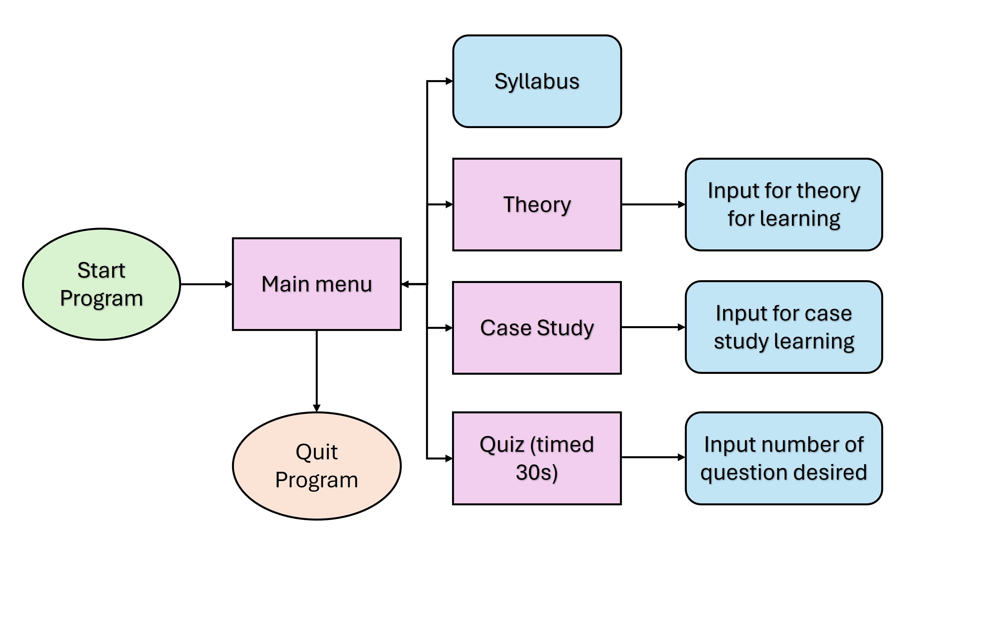

# Python Learning Application

An interactive Python learning application designed to teach Python programming fundamentals through terminal-based exercises, case studies, and quizzes.

## Project Overview

This application provides a structured learning experience with theory, practical case studies, and assessment quizzes. Users can navigate through Python concepts, work through real-world problems, and test their knowledge—all within an interactive Python terminal environment.

### Indonesian documentation [ID]
https://docs.google.com/document/d/1DHO8f-IYEwWpyoroJWEoAx_HC3CxvpF7lEGlBrPaLCM/edit?tab=t.0

## Project Structure

```
python-learning-app/
├── main.py                    # Main program entry point
├── casestudy_database.py      # Case study database and exercises
├── knowledge_database.py      # Theory content and syllabus
├── quiz_database.py           # Quiz questions and assessment engine
└── README.md                  # This file
```
## Flow Chart


## File Descriptions

**main.py**
- Entry point for the application
- Manages user interface and navigation menu
- Routes users between theory, case studies, and quizzes
- Handles user input and session management

**casestudy_database.py**
- Contains practical case study problems
- Stores real-world Python application scenarios
- Provides guided exercises for hands-on learning
- Includes problem descriptions, starter code, and solutions

**knowledge_database.py**
- Comprehensive Python theory and syllabus content
- Organized by learning topics and difficulty levels
- Provides explanations and code examples
- Supports structured learning progression

**quiz_database.py**
- Quiz questions and assessment system
- Tracks user progress and scoring
- Provides immediate feedback on answers

## Usage

The application provides a terminal-based menu interface with the following options:

- **Theory & Syllabus** - Learn Python concepts from the knowledge database
- **Case Studies** - Work through practical programming challenges
- **Quiz** - Test your understanding of Python concepts
- **Progress** - View your learning progress and scores
- **Exit** - Close the application

Follow the on-screen prompts to navigate through the learning material and complete exercises.

## Features

- **Interactive Terminal Interface** - User-friendly menu navigation
- **Structured Learning Path** - Organized progression from basics to advanced topics
- **Hands-on Practice** - Real-world case studies and coding exercises
- **Self-Assessment** - Quiz functionality to evaluate learning

- **No External Dependencies** - Uses only Python built-in functions


